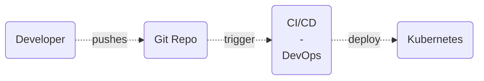
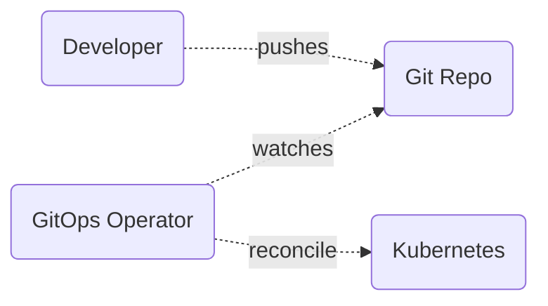
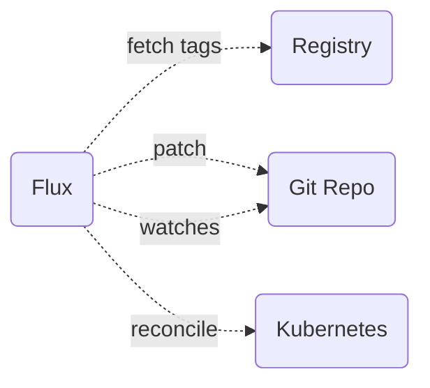

```go {all|3|4-5|6|7-8|9-14|12} twoslash
func main() {
    me := Person{
        Name:      "Davide Imola",
        Role:      "Software Engineer",
        Company:   "RedCarbon SA",
        Community: "Schrödinger Hat",
        Location:  "Verona, Italy",
        Site:      "https://links.davideimola.dev",
        Interests: []string{
            "Kubernetes",
            "Go",
            "Open Source",
            "BBQ",
            "Cybersecurity",
        },
    } 
}
```

---
transition: slide-left
handle: DavideImola
logoHeader: /logo.svg
website: links.davideimola.dev
---

# Once upon a time...

...in a galaxy far, far away, there was a developer who wanted to deploy his applications to Kubernetes.
It is the 17:30 of a Friday, and he is tired, but he wants to deploy his application before the weekend.

<div v-click class="flex mt-20 justify-center">

</div>

---
transition: slide-left
handle: DavideImola
logoHeader: /logo.svg
website: links.davideimola.dev
---

# But at a certain point...

...something unexpected happens.

<div v-click class="flex justify-center items-center mt-10">
    
</div>

---
transition: slide-left
handle: DavideImola
logoHeader: /logo.svg
website: links.davideimola.dev
---

# Problems... problems everywhere

With the current setup, our team faces several problems:

<v-clicks>

- <mdi-database-alert /> **Data inconsistency**: the state of the cluster is not the same as the state of the Git repository
- <mdi-hammer-wrench /> **Manual operations**: the developer has to manually apply the changes to the cluster
- <mdi-account-details /> **Auditability**: it is difficult to track who made the changes directly to the cluster
- <mdi-shield-off /> **Security**: the developer or CI/CD has direct access to the cluster

</v-clicks>

---
transition: slide-left
handle: DavideImola
logoHeader: /logo.svg
website: links.davideimola.dev
---

# GitOps to the rescue!

...and here comes GitOps to the rescue! <mdi-bat />

<div v-click class="flex mt-10 justify-center">

</div>

---
transition: slide-left
handle: DavideImola
logoHeader: /logo.svg
website: links.davideimola.dev
---

# Benefits of GitOps

<v-clicks>

- <mdi-database-sync /> **Data consistency**: the state of the cluster is always the same as the state of the Git repository
- <mdi-git /> **Simplicity**: the developer only interacts with the Git repository to manage infrastructure and applications lifecycle
- <mdi-robot /> **Automation**: the GitOps operator automatically applies the changes to the cluster
- <mdi-account-check /> **Auditability**: all changes are tracked in the Git repository
- <mdi-shield-check /> **Security**: no more direct access to the cluster for developers or CI/CD
- <mdi-rocket /> **Scalability**: the same process can be applied to multiple clusters
- <mdi-shield-sync /> **Disaster recovery**: the cluster can be easily restored from the Git repository
- <mdi-all-inclusive /> **DevOps all the things**: GitOps improves the DevOps culture in the team

</v-clicks>

---
transition: slide-left
handle: DavideImola
logoHeader: /logo.svg
website: links.davideimola.dev
---

# Is it a bird? Is it a plane? No, it's Flux!

Flux is a CNCF Graduated project that implements the GitOps methodology for Kubernetes.

<div grid="~ cols-2 gap-4">
<div>

It is a Kubernetes operator that continuously monitors the Git repository and reconcile the changes to the cluster.

Flux supports multiple Git providers, such as GitHub, GitLab, and Bitbucket and it is highly extensible.

It is one of the most popular tools for GitOps with ArgoCD.

</div>

<div class="flex items-center justify-center">
    
</div>
</div>

---
transition: slide-left
handle: DavideImola
logoHeader: /logo.svg
website: links.davideimola.dev
layout: statement
---

It's time to GitOps! <mdi-rocket />

---
transition: slide-left
handle: DavideImola
logoHeader: /logo.svg
website: links.davideimola.dev
---

# Image automation with Flux

Flux can also automate the image update process.

<div class="grid grid-cols-2 gap-4">
<div>

```yaml{all|2|4-5|7-8|all}
apiVersion: image.toolkit.fluxcd.io/v1beta2
kind: ImageRepository
metadata:
  name: test-app
  namespace: flux-system
spec:
  image: davideimola/test-app
  interval: 1m
```

</div>
<div>

```yaml{all|2|4-5|7-8|9-11|12-}
apiVersion: image.toolkit.fluxcd.io/v1beta2
kind: ImagePolicy
metadata:
  name: test-app
  namespace: flux-system
spec:
  imageRepositoryRef:
    name: test-app
  filterTags:
    pattern: "^main-[a-fA-F0-9]+-(?P<ts>.*)"
    extract: "$ts"
  policy:
    numerical:
      order: asc
```

</div>
</div>

---
transition: slide-left
handle: DavideImola
logoHeader: /logo.svg
website: links.davideimola.dev
---

# Image automation in action

<div v-click class="flex mt-10 justify-center">

</div>

---
transition: slide-left
handle: DavideImola
logoHeader: /logo.svg
website: links.davideimola.dev
---

# Digging into GitOps?

Today we learned the basics of GitOps but there is much more to explore!

<v-clicks>

- <mdi-form-textbox-password /> **Secret management**: how to manage secrets in a GitOps environment
- <mdi-account-group /> **Multi-tenancy**: how to manage multiple environments with GitOps
- <mdi-new-box /> **Release management**: how to manage releases with GitOps
- <mdi-monitor-dashboard /> **Monitoring and observability**: how to monitor and observe a GitOps environment

</v-clicks>

---
transition: slide-left
handle: DavideImola
logoHeader: /logo.svg
website: links.davideimola.dev
layout: center
---

# Thank you for your attention!
## Questions?
