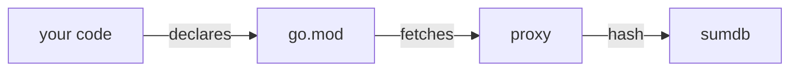

# Securing Go for Production

go run talk.go --topic="the compiler won't save you"

---
layout: intro
introImage: /theme/me.png
github: davideimola
bluesky: "@davideimola.dev"
linkedin: davideimola
---

<WhoAmI />

---
layout: section
label: "01 / why now"
transition: fade
---

# Why now

Security is becoming more and more important.

---
layout: fact
---

# 320%

attack growth YoY

<!-- FILLER number + label. Real stat TBD from Boss.
     Possible framings (each opens a different bridge to the next slide):
     a) Overall attacks/incidents YoY  → generic urgency, easy bridge ("many start in code we wrote")
     b) Supply-chain incidents YoY      → needs "the supply chain is you" bridge to reach the auth bug
     c) Breaches from logic bugs        → direct bridge to bug teaser, but narrows scope
     Pick the framing once Boss gives you the real number. -->

---
layout: split-code
---

###### intro / teaser

# We shipped this

Last year. Production.

An admin check that opened a door we didn't see.

We caught it. Barely.

<!-- Snippet adapted from the real incident. The bug is `||` where it should be `&&`: any tenant member passes the admin check on their own tenant, and tenant admins reach across tenants. Plausible in code review — that's the point. -->

::right::

```go {all|6}
func isTenantAdmin(user User, tenantID string) bool {
  if tenantID == "" {
    return false
  }

  if user.IsAdmin || user.TenantID == tenantID {
    return true
  }

  return false
}
```


---
layout: statement
---

# The compiler won't save you. Your toolchain might.

---
layout: default
---

# What we'll cover

<div class="space-y-5 mt-8">

<v-click>
<div class="flex items-baseline gap-4">
  <span class="text-2xl font-mono opacity-40">01</span>
  <h3 class="text-2xl m-0">The code you write</h3>
</div>
</v-click>

<v-click>
<div class="flex items-baseline gap-4">
  <span class="text-2xl font-mono opacity-40">02</span>
  <h3 class="text-2xl m-0">The code you use</h3>
</div>
</v-click>

<v-click>
<div class="flex items-baseline gap-4">
  <span class="text-2xl font-mono opacity-40">03</span>
  <h3 class="text-2xl m-0">Make it routine</h3>
</div>
</v-click>

</div>

---
layout: section
label: "02 / the code you write"
transition: fade
---

# The code you write

---
layout: two-cols-header
---

# Random isn't random

::left::

###### vulnerable

```go
// math/rand — seeded, predictable
n := rand.Int63()
token := fmt.Sprintf("%d", n)
```

::right::

###### secure

```go
// crypto/rand — cryptographically secure
b := make([]byte, 32)
_, _ = rand.Read(b)
token := hex.EncodeToString(b)
```

---
layout: split-code
---

###### sez 1 / SSRF

# The stdlib trusts your URL

[Setup paragraph, 2-4 lines.
Hint that `net/http` follows redirects by default,
accepts arbitrary schemes, doesn't validate against
private IPs. Reframe in your voice.]

::right::

```go
// vulnerable: fetches whatever user asks for
resp, err := http.Get(userProvidedURL)
defer resp.Body.Close()
io.Copy(w, resp.Body)
```

---
layout: split-code
---

###### sez 1 / SSRF (fix)

# Validate. Reject. Don't follow.

[Pattern principles, 2-4 lines:
- parse + validate scheme (http/https only)
- reject private IPs (loopback, RFC1918, link-local)
- disable redirect-following or whitelist destinations]

::right::

```go
// safe pattern: validate before fetching
client := &http.Client{
  CheckRedirect: func(*http.Request, []*http.Request) error {
    return http.ErrUseLastResponse
  },
}
// [+ parse URL, reject private IPs, reject non-http(s) schemes]
```

---
layout: default
---

# Other ways your code betrays you

- SQL injection → parameterized queries, always
- `html/template`, never `text/template` for HTML
- `filepath.Join` doesn't block path traversal — `Clean` + prefix check
- `io.ReadAll(r.Body)` without `MaxBytesReader` = free DoS
- `InsecureSkipVerify: true` → just don't
- Don't return `err.Error()` to the client (info leak)

<!-- spoken: "I'm not covering these. The list lives on the slides — the talk repo too." -->

---
layout: statement
---

# Back to that beautiful bug

<!-- delivery: deadpan ironic. Davide's options:
     "Thanks for the moral support. Saves on therapy."
     "Yes, we shipped this. Yes, on stage. No, we don't talk about it at home."
     Pick one or improvise. -->

---
layout: default
---

# It started with a pen test

[Setup paragraph, 3-5 lines.
e.g. "A routine penetration test found something odd:
with the right (complex) sequence of requests, a non-admin user
could reach the admin interface. We checked — it had never been exploited.
But the path was real, and we'd shipped it."]

<!-- delivery: emphasize "never exploited". The pen test caught it
     BEFORE someone with bad intent did. That's the win. -->

---
layout: default
---

# We had tests. Just not the right ones.

- Code review approved the change ✓
- Unit tests passed ✓
- Integration tests passed ✓
- **No test covered _this specific_ permission combination** ✗

<!-- delivery: this is THE meta-takeaway slide. ~45s here.
     "Reviews and tests are a net. The holes in the net are exactly
     the bugs that ship. We needed a finer net." -->

---
layout: two-cols-header
---

# We asked the model

::left::

###### prompt

[Your real prompt, sanitized.
Keep it short. Show what you ACTUALLY asked.
e.g. "Do a vulnerability assessment of this auth check.
Identify any logic issues."]

::right::

###### model output (excerpt)

[Excerpt of the AI response — sanitized.
Highlight the part that pointed to the real bug.
Mention briefly that 2 other suggestions turned out to be false positives.]

<!-- Anti-vendor: NO RedCarbon, NO commercial product screenshots.
     Use a generic LLM (Claude, GPT, Llama). -->

---
layout: statement
---

# AI gives hypotheses. Tests give truth.

<!-- delivery: pause after this. The whole AI section lives or dies on this line. -->

---
layout: default
---

# Step 3 — turn the bug into a property

```go {all|7-9}
func FuzzIsTenantAdmin(f *testing.F) {
  f.Add("alice", "acme")
  f.Add("bob", "globex")

  f.Fuzz(func(t *testing.T, userID, tenantID string) {
    user := User{ID: userID, TenantID: tenantID, IsAdmin: false}

    if isTenantAdmin(user, tenantID) {
      t.Fatalf("non-admin %q passed admin check on %q", userID, tenantID)
    }
  })
}
```

<!-- delivery: open by saying:
     "First we did it the manual way — a matrix of every role × every tenant.
     Once we found the breaking case, we made it permanent.
     A property the fuzzer keeps checking, forever, on every commit."
     Then highlight the assertion with `<Space>` and explain the property. -->

---
layout: terminal
title: "$ go test -fuzz=FuzzIsTenantAdmin -fuzztime=10s"
---

```sh
fuzz: elapsed: 0s, gathering baseline coverage: 2/2 completed, now fuzzing
fuzz: elapsed: 1s, execs: 8421 (8421/sec), new interesting: 12

--- FAIL: FuzzIsTenantAdmin (1.04s)
    auth_test.go:8: non-admin "alice" passed admin check on "acme"

    Failing input written to testdata/fuzz/FuzzIsTenantAdmin/3f9ab8c7
    To re-run:
        go test -run=FuzzIsTenantAdmin/3f9ab8c7
FAIL
```

<!-- Optional: run this LIVE during the talk (low risk, local repo).
     If WiFi/setup breaks, this static screen is the fallback. -->

---
layout: split-code
---

###### sez 1 / step 4 — fix + CI

# One operator. One workflow.

The fix: `||` → `&&`.

Code review missed it. Existing tests didn't cover it.

**The fuzz test won't miss it again.**

::right::

```yaml
# .github/workflows/security.yml
- name: Fuzz auth properties
  run: |
    go test -fuzz=FuzzIsTenantAdmin \
      -fuzztime=30s ./auth
```

---
layout: section
label: "03 / the code you use"
transition: fade
---

# The code you use

---
layout: default
---

# When npm was npm

[Narrative, 4-6 lines. Tell the Axios story sharply.
- WHEN: date the malicious version went live (March 2026?)
- WHAT: maintainer account compromised → malicious release auto-shipped
- HOW BIG: weekly downloads (cite exact number, e.g. "~50M weekly")
- TIME WINDOW: hours / days the bad version was live
- PAYLOAD: brief — data exfiltration? backdoor? what kind?
- CLEANUP: why it was hard (caching, auto-install, lockfiles)]

<!-- FILLER — gather exact numbers + payload details before the talk.
     Open question in TALK.md. Without numbers this slide is just rhetoric. -->

---
layout: default
---

# "But this is npm." Is it?

[Bridge line, 1-2 lines. e.g. "Go has better defaults. It's not bulletproof."]

- [Go-side case 1 — e.g. `tj-actions/changed-files` (March 2025), secrets leaked from Go CI pipelines via a compromised GitHub Action]
- [Go-side case 2 — research a real recent module compromise / typosquatting incident]

<!-- FILLER — research 1-2 real Go-side supply chain incidents before the talk.
     If only 1 solid case exists, use 1 bullet (don't pad).
     Open question in TALK.md. Goal: stop the audience thinking "this is a JS problem". -->

<!-- delivery: ~30-45s. Not a deep dive — acknowledgement.
     "Go has the infrastructure. But the infrastructure is only as good as your habits." -->

---
layout: statement
---

# Go gives you the answer: sumdb.

<!-- delivery: short beat, pivot. The npm story sets up the urgency.
     This statement says "we have a defense — and you're probably not using it consciously." -->

---
layout: default
---

# Go modules — the trust chain



<!-- delivery: ~45s. Walk left-to-right. The arrows tell the story:
     code declares deps, proxy fetches them, sumdb provides the hash.
     Then click to the next slide for the verify command.

     === NOTES: HOW IS THIS DIFFERENT FROM npm? ===
     Important nuance: the Axios incident was a NEW minor release (e.g. 1.15.0 → 1.15.1)
     pushed by the compromised maintainer account, NOT a rewrite of an existing version.
     sumdb protects you from rewrites of an existing version's hash; it does NOT
     protect you from a brand-new malicious release. The protections that matter
     for the Axios-class threat are different:

     1) Exact versions in go.mod (no caret/tilde ranges).
        npm with `^1.15.0` pulls 1.15.1 automatically on the next `npm install`.
        Go's `go.mod` pins an exact version. The new malicious 1.15.1 is NOT
        downloaded until you explicitly run `go get -u` or update `go.mod`.

     2) No auto-update without intent.
        Go updates are deliberate: `go get pkg@latest`, `go mod tidy`, or a
        manual edit. npm's defaults move silently inside the version range.

     3) No script execution at install.
        This is where Axios actually got people: the postinstall script ran
        the moment `npm install` resolved the new version. Go's `go get` /
        `go build` don't execute arbitrary code — a module runs only when
        you explicitly import and call it.

     4) (still true, different threat) sumdb is a transparent, immutable log.
        Protects against rewrites/MITM on existing versions. Doesn't help
        for new malicious releases — but eliminates a different attack class
        entirely. npm has no equivalent.

     PUNCHY LINE if you want it on stage:
     "If a maintainer's account got compromised tomorrow and they pushed v1.15.1
     with a malicious payload: in Go, your `go.mod` still pins v1.15.0 — the new
     version isn't pulled until you explicitly run `go get -u`. And even then,
     the code doesn't execute until you actually use the affected API.
     In npm, with `^1.15.0` and a postinstall script, you're owned by the next
     `npm install`."
-->

---
layout: terminal
title: "$ go mod verify"
---

```sh
all modules verified
```

`go.sum` records the hashes. **`go mod verify`** confirms they still match on disk.

<!-- delivery: ~30s. The point: the verification is one command,
     it should run in your release pipeline. Pair it with `govulncheck`. -->


---
layout: default
---

# What about CVEs in our dependencies?

Hashes match. But are any of them known to have CVEs?

Go has an official scanner for that. Let's run it.

---
layout: terminal
title: "$ govulncheck ./..."
---

```sh
$ govulncheck ./...
Scanning... 234 packages, 12 modules.

Vulnerability: GO-2025-61728
  Standard library
    Found in:    archive/zip@go1.21.5
    Fixed in:    archive/zip@go1.22.0
    Example trace:
      main.go:42  app.HandleUpload → archive/zip.NewReader

Your code is affected by 1 vulnerability.
```

<!-- LIVE DEMO start. Plan B: GOVULNDB local mirror + asciinema + this slide as static fallback.
     Cut from real output: long URL, prose CVE description (covered by next slide),
     the boilerplate scan line. Kept: stdlib (dramatic), versions (actionable),
     trace (the call-graph differentiator — that's the whole point). -->


---
layout: default
---

# It scans your call graph, not your go.sum

[Narrative, 3-5 lines. The KEY differentiator:
- govulncheck walks the call graph from your `main`
- Out of N CVEs in your dependencies, only the ones you *reach* are reported
- Less noise → fixes you'll actually do
- Example: "7 CVEs in `go.sum`, 2 in our call graph. The other 5 were quiet."]

<!-- delivery: this is THE slide that sells govulncheck over alternatives.
     Spend 90s here. The live demo on the previous slide is the wow,
     this is the explanation that makes it stick. -->

---
layout: default
---

# CVE-2025-61728 — zip DoS

A malformed zip file → unbounded CPU/memory consumption.

Any service that decompresses user-uploaded zips dies.

You don't need to know how. **`govulncheck` knows for you.**

<!-- 30 seconds max. Concept slide only — NO live exploit PoC.
     The "you don't need to know how" line reinforces the thesis:
     the toolchain does the work, you don't need to be a security expert. -->

---
layout: terminal
title: "$ go get -u && govulncheck ./..."
---

```sh
$ go get -u
go: upgraded archive/zip to v1.22.0

$ govulncheck ./...
Scanning your code and 234 packages across 12 dependent modules
for known vulnerabilities...

No vulnerabilities found.
```

<!-- delivery: short. The fix is one command. Keep it punchy.
     "That's it. We're back to clean. On every commit, this gets re-run." -->

---
layout: split-code
---

###### sez 2 / in CI

# Bring it to your pipeline

You install `govulncheck` once. It runs on every PR and push.

The build fails on new vulnerabilities.

::right::

```yaml
# .github/workflows/security.yml
name: Security
on: [pull_request, push]
jobs:
  govulncheck:
    runs-on: ubuntu-latest
    steps:
      - uses: actions/checkout@v4
      - uses: actions/setup-go@v5
        with: { go-version: 'stable' }
      - run: |
          go install \
            golang.org/x/vuln/cmd/govulncheck@latest
          govulncheck ./...
```

---
layout: statement
---

# You fixed the known. What about the unknown?

<!-- transition to sez 3. "Known" = govulncheck (CVEs in DB).
     "Unknown" = SBOM (what's actually in your build), SLSA (what you shipped),
     AI (hypothesis-driven assessment). Pause briefly, then click to next section. -->

---
layout: section
label: "04 / make it routine"
transition: fade
---

# Make it routine

---
layout: default
---

# Monday morning

<v-clicks>

- Add `govulncheck` to your CI — one PR, one workflow file
- Write one fuzz test on your most critical auth path
- Add `go mod verify` to your release pipeline

</v-clicks>

<div class="mt-12 opacity-60 text-sm">
  More on the talk repo: <code>gosec</code>, dependency hygiene, fuzz patterns.
</div>

<!-- delivery: ~2min. Read each item, half a beat between. The point isn't
     to teach — they already saw it — it's to make it concrete and small. -->

---
layout: default
---

# Beyond the toolchain

- **SBOM** — know what's actually in your build (`cyclonedx-gomod`, `syft`)
- **SLSA** — prove what you shipped is what you built
- Both deserve their own talk. **Golab has them. Check the schedule.**

<!-- delivery: ~90s. Don't teach SBOM/SLSA. Acknowledge they exist,
     point to other talks. The honesty buys you trust. -->

---
layout: split-code
---

###### sez 3 / take this

# Ship Monday

I packaged everything we covered.

`govulncheck`, fuzz tests, SBOM generation, SLSA provenance.

One composite GitHub Action. One line in your workflow.

::right::

```yaml
# .github/workflows/security.yml
- uses: davideimola/<action-name>@v1
  with:
    fuzz-time: 30s
```

<!-- TBD: real action repo + name. See open question in TALK.md.
     QR/link to repo will be in the final cover slide. -->

---
layout: default
---

# AI is the next tool

- Use AI for **vulnerability assessment**, not just code writing or review
- Validate every suggestion with a test

<div class="mt-10 border-l-4 pl-6 opacity-90">

Attackers are using AI today.

Defenders are still arguing about it.

**Don't be on the wrong side.**

</div>

<!-- delivery: ~90s. The bullets are the practical advice;
     the blockquote is the closing punch of this slide. Pause after
     "Don't be on the wrong side." Let it sit. -->

---
layout: statement
---

# Don't aim for perfect. Aim for paranoid and fix fast.

<!-- delivery: this is THE closing line. After this slide, the cover
     "Thank you" appears. Pause. Audience claps. Walk off. -->

---
layout: cover
---

# Thank you

exit 0

<div class="absolute bottom-20 right-20 flex flex-col items-center gap-3">
  <QRCode value="https://links.davideimola.dev" :size="140" dark="#eae5df" light="#080807" />
  <span class="text-xs font-mono" style="color: #7E7874;">links.davideimola.dev</span>
</div>
